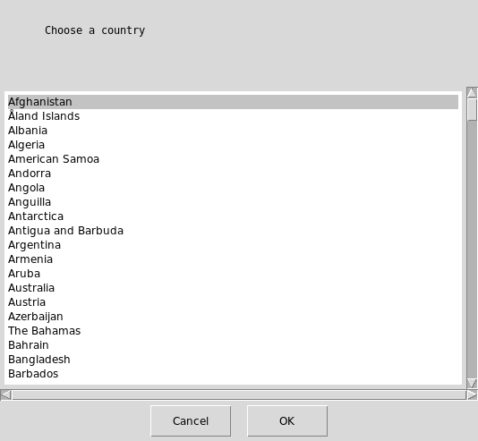
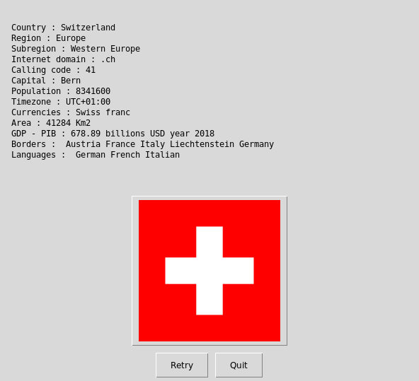

   

# World Register of nations



  

## What's this software ?  

This Python 3 software find and display information about all countries in the world.

## Download the Windows .exe version :

You can run it with Python 3 and the right libraries or for Windows you can use the .exe software that I created there :

[](https://sourceforge.net/projects/world-register-of-nations/files/latest/download)
[](https://sourceforge.net/projects/world-register-of-nations/files/latest/download)


1) Please install ImageMagick (https://www.imagemagick.org/)

IMPORTANT : in Windows the software don't display the pictures without ImageMagick.

you will find ImageMagick-7.0.8-37-Q16-x64-dll with in this folder or you can download it from the official website imagemagick.org.
When you install it it's important to let it add ImageMagick to your Windows Path.

2) Run World_Register_GUI.exe


## Sources :

https://restcountries.eu/

and

https://en.wikipedia.org/wiki/ISO_3166-1#Current_codes

and

http://docs.tradingeconomics.com/
   

## What you need to make it work :  


The last version of Python 3.

you also need to have the easygui library for python 3:

At least the version 0.98

```sh
sudo python3 -m pip install --upgrade easygui 
```

You need wget for python 3:


```sh
sudo pip3 install wget
```


## How to launch this software :  

```sh
python3 World_Register_GUI.py
```  

## Requirements :

If you miss a module, install it with the command pip install module-name. For example if you miss PIL you can install it with : sudo pip3 install pillow.


## Developer - Author

Hamdy Abou El Anein

## Homepage

http://www.daylightlinux.ch 
